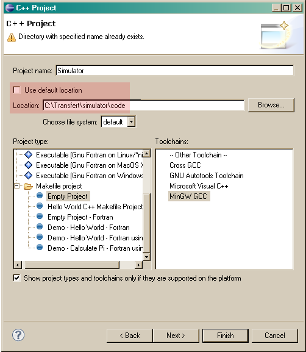
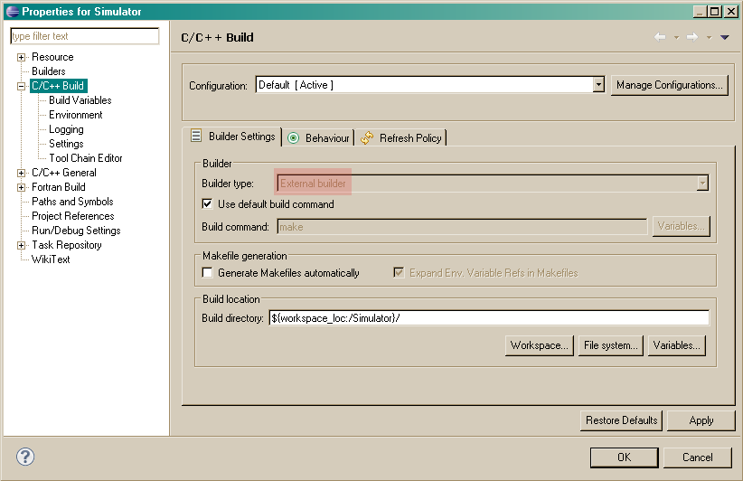
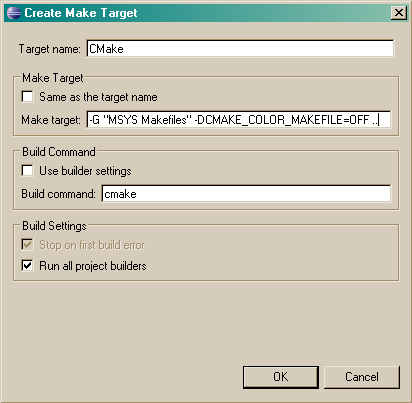

% IRT JV Simulator - Developer Guide
% Guillaume Jacquenot, Charles-Edouard CADY

This page is guide for the development of the lightweight temporal ship simulator.
To generate this document, run:
``pandoc dev_guide.md -s -c ../planning/stylesheet.css --toc -o dev_guide.html``

This simulator is composed of a *kernel* that contains the core of the simulator and
a set of modules that represent the physical models implemented in the simulator.

The kernel relies on previous developments and is thus the property of DCNS Research.
The modules are developped within the context of the project and are the property
of IRT Jules Verne.

This simulator is written in C++ and relies on:

* a decentralized version control system (DCVS)
* a continuous integration server that ensures the integrity of the development.

The following explains the philosophy of the development.

# Guidelines

Source files are versionned using [GIT](http://www.git-scm.com) version 1.8.5.2 (windows) 1.7.9.5 (linux),
a free and open-source distributed version control system.

Among the many pros of GIT, it will allow easy branching for
the development of new features.

The tasks of the continuous integration server are:

* Retrieve the source code from the DCVS
* Compile the source code
* Create the documentation of the program
* Test the sources with automatic unit testing
* Calculate various metrics on the code
* Perform code coverage and memory leak detection
* Create an installation program
* Deploy a release to the client

The continuous integration server used in this project
is [Jenkins](http://www.jenkins-ci.org).

It is used on a Windows OS (Windows XP) and a POSIX OS (Ubuntu).

# File repositories
Because of the nature of the project, two GIT file
repositories hosted on [Sir6](http://130.66.124.6/public/DOP/EtudesEnCours/ETI140043/) are be used :

* One that contains all developments performed during the project.
  It contains all the source code of
  the physical models included in the simulator. It also
  contain all the source code of the kernel of the simulator
  with, e.g., the ``DataSource`` that has been developed
  for another project (EONAV).
* One that matches the repository hosted on the IRT JV's Git Lab server.
  It contains all physical models developed during this project
  with the binary version the kernel library.

As a consequence, two Jenkins jobs are used to compile, test and deploy
the source code stored on these two file repositories.

# Version control
The DVCS used is Git. The repository was initially created on a shared folder
on ``pc-maroff``. It was then cloned on ``pc-gj`` while waiting for a git server
on sir6. However, the installation of a Git server on sir6 proved unnecessary
because the repository could be treated as a normal folder by Samba. The downside
is a possible performance lag (compared to using ssh or the ``git`` protocol).
The reference repository is now located at:

[http://130.66.124.6/public/DOP/EtudesEnCours/ETI140043/simulator.git](http://130.66.124.6/public/DOP/EtudesEnCours/ETI140043/simulator.git)

# Jenkins jobs

This section presents the two Jenkins jobs
corresponding to the two file repositories (internal to SIREHNA & external for
IRT JV).

## Sirehna/DCNS Research file repository

| Jobs                  | Description                                                                                                                    |
| :---------------------| :------------------------------------------------------------------------------------------------------------------------------|
| ``build``             | Compile all the source files required to generate the libraries and program associated to the simulator                        |
| ``document``          | Generate the program documentation with [Doxygen](http://www.doxygen.org)                                                      |
| ``get_test_data``     | Generate all the test data required to execute unit tests                                                                      |
| ``test``              | Perform the unit testing of the code and produce a XML JUnit report                                                            |
| ``valgrind``          | Perform a memory check on the test program for Unix platform                                                                   |
| ``report``            | Parse all report files and generate synthetic diagram                                                                          |
|                       | to follow the evolution of the project                                                                                         |

## IRT JV file repository

| Jobs                  | Description                                                                                                         |
| :---------------------| :------------------------------------------------------------------------------------------------------------------ |
| ``build``             | Compile all the source physical models required to generate simulator and link against the compiled kernel library  |
| ``manual``            | Retrieve all the information needed for the user manual and publish it                                              |
| ``get_test_data``     | Generate all the test data required to execute unit tests                                                           |
| ``test``              | Perform the integration tests                                                                                       |
| ``package``           | Create an installation program that will be used by the final user                                                  |

# Developpement environment

This section presents the tools and libraries used to perform the development of the simulator.

The compiler chosen for this project is [GNU GCC 4.5.2](http://gcc.gnu.org/gcc-4.5).
The rationale behind this choice is that this compiler is widely used at Sirehna.
GCC 4.6 is used on the Linux platform (Ubuntu) because:

- More errors are detected by GCC 4.6
- Code coverage appears to be broken with CMake & GCC 4.5.2.

## Generic tools used
| Tools                                         | Description                                                   |
| :-------------------------------------------  | :------------------------------------------------------------ |
| [GIT](http://www.git-scm.com)                 | Cross-platform open-source build system                       |
| [CMake](http://www.cmake.org)                 | Cross-platform open-source build system                       |
| [Eclipse](http://www.eclipse.org)             | IDE with module CDT                                           |
| [Jenkins](http://www.jenkins-ci.org)          | Continuous integration tool                                   |
| [Pandoc](http://johnmacfarlane.net/pandoc/)   | Tool to used to generate documentation                        |
| [Doxygen](http://www.doxygen.org)             | Tool for generating documentation from annotated C++ sources  |
| [Graphviz](http://www.graphviz.org)           | Optional tool for graph generation with documentation         |

## Specific Windows tools
| Tools                                             | Description                               |
| :------------------------------------------------ | :---------------------------------------- |
| [MINGW-MSYS](http://www.mingw.org)                | Tool chain compilation                    |
| [MikTeX](http://www.miktex.org)                   | LaTeX compiler                            |
| [NSIS](http://www.nsis.sourceforge.net/Main_Page) | Installation program generation           |
| [Notepad++](http://www.notepad-plus-plus.org)     | Open source code editor                   |

## Thirdparty libraries
| Library                                           | Description                               |
| :-------------------------                        | :---------------------------------------- |
| [GTest](http://www.code.google.com/p/googletest)  | MIT Open-source unit testing library      |
| [Yaml-CPP](http://www.code.google.com/p/yaml-cpp) | MIT Open-source input/output file library |
| [Lapack](http://www.netlib.org/lapack)            | BSD Open-source C/Fortran algebra library |
| [Eigen](http://www.eigen.tuxfamily.org/index.php) | MPL2 Open-source C++ algebra library      |

# Development policy and coding rules

## Development rules

Development will follow the Git branching model described [here](http://nvie.com/posts/a-successful-git-branching-model/):

* Each new feature should be developed in a new branch.
* While developing these new features, a rebase on the trunk should be run regularly
  to fix possible merge conflicts as soon as possible, from the feature branch.

## Coding rules

* EOL should be Unix-styles with LF characters.
* File should be UTF-8 encoded.
* Committed files should not contain any trailing spaces.
* Class names are CamelCase & start with an uppercase letter
* Namespaces & variables are lower case, separated by underscores
* No m_ in front of member variables (need for such a convention is a sign
  classes have too many members)
* Use RAI objects (such as std::tr1::shared_ptr) for memory management
* In general, there should not be more than half a dozen members & half a dozen
  methods per class
* Use forward-declarations (if practical) to split compilation units
* Heavy use of STL & external, proven libraries (such as boost, Lapack, Blas, Eigen...)
  (do not reinvent the wheel)
* For more informations, check the [wiki](http://sir6:8080/xwiki/bin/view/Espace+de+travail+commun/Checklist+de+Revue+de+code).

# Instructions to setup the development environment

## Get the source code

* Create an RSA key. For example, under MinGW, use ``ssh-keygen``. Please note
  that changing terminal often implies a different location of the configuration
  files which may lead to SSH not seeing the public RSA key.
* Send the public key (``.pub`` extension) to the system administrator
* The system administrator adds the key to ``/sir7/home/people/git_simulateur/.ssh/authorized_keys``
* Test the setup is correct by running ``ssh git_simulateur@sir7`` from a MinGW
  terminal. If a prompt appears, setup is correct. If a password is requested,
  the RSA key was not found.
* You can then run ``git clone ssh://git_simulateur@130.66.124.7/home/public/DOP/EtudesEnCours/ETI140043/simulator.git``
  which will retrieve the source code.

## Instructions for Eclipse
This is how to setup the build environment, in seven easy steps.

1. Create a new project from Eclipse
    
2. Select C++ Project
    
3. Don't use default location
    
4. Choose "Empty Project"
    
5. Choose MinGW GCC toolchain
    
6. Select build location
    
    
    
7. Create build targets
    
    

## Building

Below are the typical commands to run to compile the simulator:

* ``cd simulator``
* ``mkdir build``
* ``cd build``
* ``cmake -G "MSYS Makefiles" ..``
* ``make``
* ``make doc``
* ``make install``
* ``make test``
* ``make package``

# Process

The methodology used in this project is a variant of the Extreme Programming
methodology.

## Artefacts

Progress is made visible to the developpers, users & product owner by a physical
kanban board & an HTML planning tool, homemade by CEC & which will be visible on
the project's Jenkins page.

### Kanban board

A kanban board. It contains three columns (todo, started & done) & post-its
of various sizes & colors with the following conventions:

- User stories (functional requirements): big blue post-it
- Dev stories (non-functional requirements): big orange post-it
- Interface tasks: small green post-it
- Kernel tasks: small purple post-it
- Physical models tasks: small yellow post-it  
- Dev tasks: small pink post-it

### Planning tool

Burndown & burnup charts are automatically generated using the data stored in
two YAML files stored in the ``planning`` subdirectory.

### User stories

As stated on [Wikipedia](https://en.wikipedia.org/wiki/User_story), *a user
story is one or more sentences in the everyday or business language of the end
user or user of a system that captures what a user does or needs to do as part
of his or her job function.* User stories are entered using [Bugzilla](http://sir6/bugzilla/buglist.cgi?bug_status=UNCONFIRMED&bug_status=NEW&bug_status=OPEN&bug_status=ANALYSED&bug_status=ASSIGNED&bug_status=IMPLEMENTED&columnlist=priority%2Cassigned_to%2Cbug_status%2Cshort_desc%2Ccomponent%2Cdeadline&content=&product=Simulateur&query_format=specific&query_based_on=).
They are written in the following form:

**As a** *role*, **I want** *functionality* **so that** *benefit*

* *role*: type of user. This impacts the expected interface & the level of detail
in user interactions.
* *functionality*: actual feature being implemented.
* *benefit*: marketable value of the feature (how the customer will earn or save
money using the feature).

User stories should follow the **INVEST** guidelines:

|Letter  |  Meaning                      | Description
| :------|:------------------------------|:----------------------------------------------------------------------------------------------------------------------|
|I       | Independent                   | The user story should be self-contained, in a way that there is no inherent dependency on another user story.     |
|N       | Negotiable                    | User stories, up until they are part of an iteration, can always be changed and rewritten.                        |
|V       | Valuable                      | A user story must deliver value to the end user.                                                                  |
|E       | Estimable                     | You must always be able to estimate the size of a user story.                                                     |
|S       | Sized appropriately or Small  | User stories should not be so big as to become impossible to plan/task/prioritize with a certain level of         |certainty.
|T       | Testable                      | The user story or its related description must provide the necessary information to make test development possible.|