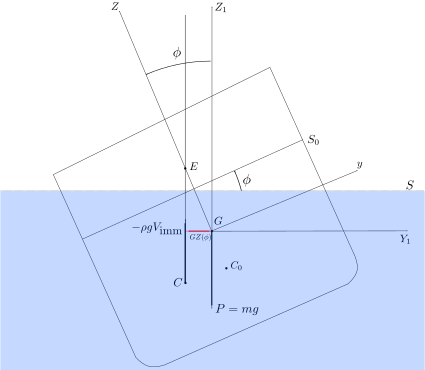

# Courbes de stabilité

## Stabilité en roulis

Parmi les performances navales, les plus importantes tant du point
pratique que théorique sont les performances en roulis et en tangage. On s'intéresse ici
plus particulièrement à la stabilité du navire en roulis. Du point de vue
réglementaire, la stabilité des navires est soumise à des conditions strictes,
définies par exemple dans les arrêtés du 28 février 1975 (bateaux non motorisés) et du 2
septembre 1970 (bateaux motorisés).

On considère un navire partiellement immergé en eau calme (la surface libre
étant donc plane et horizontale) dont le volume immergé $\Omega$ est délimité par une
surface appelée "carène" (ou surface mouillée) et notée $\mathcal{C}$.
On appelle "surface de flottaison" et l'on note $S$
l'intersection du volume du navire avec le plan de la surface libre.
On a donc $\partial\Omega = \mathcal{C}\cup S$.
On note $G$ le centre de gravité du navire et $C$ le centre de $\Omega$ (appelé
"centre de carène").

Les axes $Y$ et $Z$ du [repère "body"](#reperes-et-conventions) sont notés
respectivement $y$ et $z$. La situation peut être représentée par la figure
suivante :

La distance algébrique $GZ=y_C-y_G$ est le bras de levier du couple de rappel
hydrostatique. Celui-ci doit être suffisant pour redresser le navire. Une
condition nécessaire et suffisante pour que le le couple de rappel
hydrostatique soit un couple de redressement est que le point métacentrique $E$
soit situé au-dessus du centre de gravité $G$. Le point $E$ est à
l'intersection de la droite $Cz$ et de la droite $C_0 z$.

### Algorithme de calcul de $GZ$

Pour calculer $GZ(\phi)$, il faut connaître la position du centre de carène
pour une position d'équilibre à un angle de gîte $\phi$. On commence donc
par calculer la position d'équilibre pour une gîte donnée, puis on calcule le
centre de carène et $GZ$ est ensuite donné par $GZ(\phi)=y_C(\phi)-y_G$.

#### Calcul de la position d'équilibre à une gîte donnée

Soit $X=(z,\phi,\theta)$ l'etat du système. On suppose le navire soumis aux seuls efforts de
la gravité et de l'hydrostatique. On dénote par $f$ la fonction qui à $X$
associe la somme des efforts appliqués au système :

$$f(X) = F_{\mbox{hs}}(X) + m\cdot \mathbf{g}$$

où $m$ désigne la masse du système et $\mathbf{g}$ est le vecteur
accélération de la pesanteur.

Lorsque le système est à l'équilibre, on a :

$$f(X_{\mbox{eq}})=0$$

Pour résoudre cette équation, on peut par exemple utiliser la méthode de
Newton-Raphson :

$$X_{n+1} = X_n - f'(X_n)^{-1}f(X_n)$$

On note $$K(X) = \frac{\partial f}{\partial X}(X)$$

$$X_{n+1} = X_n - K^{-1}(X_n)f(X_n)$$

La matrice $K(X_n)$ est estimée numériquement en linéarisant $f$ autour de
$X_n$. Soit $\Delta X$ un petit déplacement autour de $X_n$ et $\Delta F =
(\Delta F_z, \Delta M_{\phi}, \Delta M_{\theta})$ la
variation d'effort correspondante.

$$K(X_n) \Delta X = \Delta F$$

Pour $1\leq i\leq 3, \sum_{j=1}^3 k_{ij} \Delta x_j = \Delta F_i$.

Si le petit déplacement que l'on considère s'effectue exclusivement suivant l'axe $j$, on
trouve :

$k_{ij}\Delta x_j = \Delta F_i$ donc

$$k_{ij} = \frac{\Delta F_i}{\Delta x_j}$$

En pratique, pour évaluer les termes de la matrice $K(X_n)$, on considère
séparément trois petits déplacements autour de $X_n$ (un par axe) et l'on
utilise la formule précédente pour évaluer les termes $k_{ij}$ trois par trois.

Une simplification possible est de considérer que la matrice $K$ varie peu et
donc de ne l'évaluer qu'une seule fois (plutôt qu'à chaque étape de
l'algorithme de Newton-Raphson).

#### Calcul du centre de carène $C$

La carène est discrétisée par des polygônes. Pour calculer son centre de masse,
on transforme ces polygônes en triangles et, pour chaque triangle, on calcule
le volume (algébrique) du tétraèdre de base ce triangle et de sommet l'origine.

En effectuant la somme de ces volumes élémentaires on retrouve le volume
délimité par le maillage. Le centre de carène est calculé de la façon suivante.

Soit $P_1,P_2,P_3$ les trois sommets d'un des triangles. Le volume élémentaire
$dV$ associé à ce triangle est le déterminant des vecteurs $P_1,P_2,P_3$ :

$$dV=\mbox{det}(P_1,P_2,P_3)$$

Les coordonnées du centre (par rapport à l'origine choisie pour les tétraèdres) sont données par :

$$x_C = \frac{1}{\sum_{\mbox{facet}}dV}\sum_{\mbox{facet}}\frac{x(P_1)+x(P_2)+x(P_3)}{4}dV$$
$$y_C = \frac{1}{\sum_{\mbox{facet}}dV}\sum_{\mbox{facet}}\frac{y(P_1)+y(P_2)+y(P_3)}{4}dV$$
$$z_C = \frac{1}{\sum_{\mbox{facet}}dV}\sum_{\mbox{facet}}\frac{z(P_1)+z(P_2)+z(P_3)}{4}dV$$

## Outil de calcul de $GZ$

Parallèlement au simulateur, un autre exécutable appelé `gz` permet de calculer
$GZ$ en fonction de la gîte $\phi$.

Cet outil prend en entrée des paramètres de ligne de commande et un fichier
YAML au même format que celui pour le simulateur. Contrairement au
simulateur, l'outil `gz` n'utilise ni les conditions initiales, ni les sorties,
ni les efforts extérieurs spécifiés dans le fichier YAML.

## Références
- *Hydrodynamique des Structures Offshore*, 2002, Bernard Molin, Editions TECHNIP, ISBN 2-7108-0815-3, page 398
- *Seakeeping: Ship Behaviour in Rough Weather*, 1989, A. R. J. M. Lloyd, Ellis Horwood Series in Marine Technology, ISBN 0-7458-0230-3, page 191
- *Dynamique du Navire*, 1986, P. Devauchelle, Bibliothèque de L'Institut Français d'Aide à la Formation Professionnelle Maritime, ISBN 2-225-80669-1, p. 168
- *Hydrodynamique navale : théorie et modèles*, 2009, A. Bovis, Presses de l'ENSTA, p. 79
- *Stabilité des bateaux - examen d'un dossier*, CETMEF, décembre 2012, p.11
