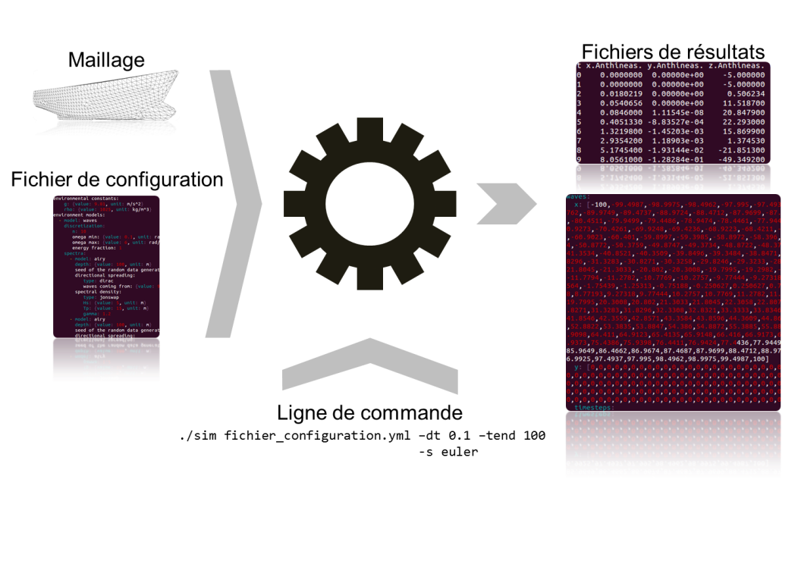

# Description

Le présent programme est un simulateur de corps solides indéformables dans un
environnement fluide. Il s'agit d'un outil en ligne de commande, c'est-à-dire
qu'on le lance depuis un terminal (ou une invite de commande MS DOS).

## Entrées et sorties

Le simulateur a été construit pour permettre une utilisation modulaire en ligne
de commande. Pour ce faire, les différents domaines à configurer sont séparés :
la description du problème physique est faite dans un ou plusieurs fichiers
d'entrée et la description de la simulation (pas de temps, solveur...) est
faite en ligne de commande. De cette manière, on peut facilement lancer des
simulations du même problème avec des solveurs différents et sur des durées
différentes, sans toucher au(x) fichier(s) de configuration du problème.

Le fichier de description du problème peut être séparé en autant de fichiers
que l'on veut, ce qui permet par exemple de versionner la configuration de
l'environnement physique séparément de celle du ou des solides.

En sortie, le simulateur génère un fichier de résultat au format CSV contenant
tous les états du ou des solides. Il peut également générer un fichier YAML
contenant des hauteurs de houle sur un maillage. La figure suivante résume les
entrées et sorties du simulateur :

## Structure de la documentation

La documentation "utilisateur" du simulateur est composée de cinq parties :

- Le présent fichier, qui donne une vue d'ensemble du simulateur ainsi que la
  documentation de l'exécutable,
- [Des tutoriels](tutorials.html) permettant d'appréhender le fonctionnement de
  l'outil sur des cas concrets,
- [Une documentation du fichier d'entrée](documentation_yaml.html) donnant le
  paramétrage de tous les modèles connus par le simulateur,
- [Une documentation des modèles physiques](modeles_reperes_et_conventions.html) avec des références vers la
  documentation du fichier d'entrée, pour la définition des phénomènes physiques
  modélisés,
- [Une documentation du solveur](solver.html) qui détaille l'algorithme
  d'intégration numérique utilisé.

Parallèlement à cette documentation utilisateur, il existe également une
documentation d'implémentation décrivant l'architecture logicielle et
détaillant les API pour faciliter la maintenance du code (correctifs et
ajouts de fonctionnalités).

# Ligne de commande

## Liste des arguments

~~~~~~~~~~~~~~~~~~~~ {.bash}
USAGE: sim <yaml file> [-h] [-y ARG] [-o ARG] [-s ARG] [dt ARG] [--tstart ARG]
[--tend ARG] [-w ARG]
Options:
  -h [ --help ]              Afficher le message d'aide (en anglais)
  -y [ --yml ] arg           Nom du (ou des) fichier(s) YAML (le flag est facultatif)
  -s [ --solver ] arg (=rk4) Nom du solveur : euler,rk4,rkck for Euler,
                             Runge-Kutta 4 et Runge-Kutta-Cash-Karp
                             respectivement.
  --dt arg                   Pas de temps initial (pour les solveurs à pas
                             variable) ou pas de temps fixe (pour les solveurs
                             à pas fixe)
  --tstart arg (=0)          Date correspondant au début de la simulation
                             (en secondes)
  --tend arg                 Dernier instant calculé
  -w [ --waves ] arg         Nom du fichier YAML de sortie pour la houle (le
                             cas échéant). Cf. section 'output' du fichier YAML
                             d'entrée
  -c [ --commands ] arg      Nom du fichier contenant les commandes à appliquer
                             à chaque instant. Cf. section 'Efforts commandés'
~~~~~~~~~~~~~~~~~~~~

Le paramètre `-w` ne sera pas décrit ici mais dans [le fichier de description
des modèles](documentation_yaml.html#waves).
Le paramètre `-c` ne sera pas décrit ici mais dans [le fichier de description
des modèles](documentation_yaml.html#efforts-commandés).

## Exemples

### Simulation avec un solveur Runge-Kutta d'ordre 4 en commençant à t=0

~~~~~~~~~~~~~~~~~~~~ {.bash}
./sim tutorial_01_falling_ball.yml --dt 0.1 --tend 1
~~~~~~~~~~~~~~~~~~~~

Par défaut, les sorties se font sur la sortie standard (le terminal). Ceci
permet de chaîner les traitements (pipe UNIX), par exemple :

~~~~~~~~~~~~~~~~~~~~ {.bash}
./sim tutorial_01_falling_ball.yml --dt 0.1 --tend 1 | python plot.py test 0 3
~~~~~~~~~~~~~~~~~~~~

La commande précédente lance la simulation et génère un tracé (format SVG) à
l'aide du script python de post-traitement livré avec le simulateur.

On peut bien sûr choisir de rediriger les sorties vers un fichier :

~~~~~~~~~~~~~~~~~~~~ {.bash}
./sim tutorial_01_falling_ball.yml --dt 0.1 --tend 1 > out.csv
~~~~~~~~~~~~~~~~~~~~

ou alors spécifier directement en tant que paramètre de la ligne de commande :

~~~~~~~~~~~~~~~~~~~~ {.bash}
./sim tutorial_01_falling_ball.yml --dt 0.1 --tend 1 -o out.csv
~~~~~~~~~~~~~~~~~~~~

### Simulation avec un solveur Euler en commençant à t=1

~~~~~~~~~~~~~~~~~~~~ {.bash}
./sim tutorial_01_falling_ball.yml -s euler --dt 0.1 --tstart 1 --tend 1.2
~~~~~~~~~~~~~~~~~~~~

