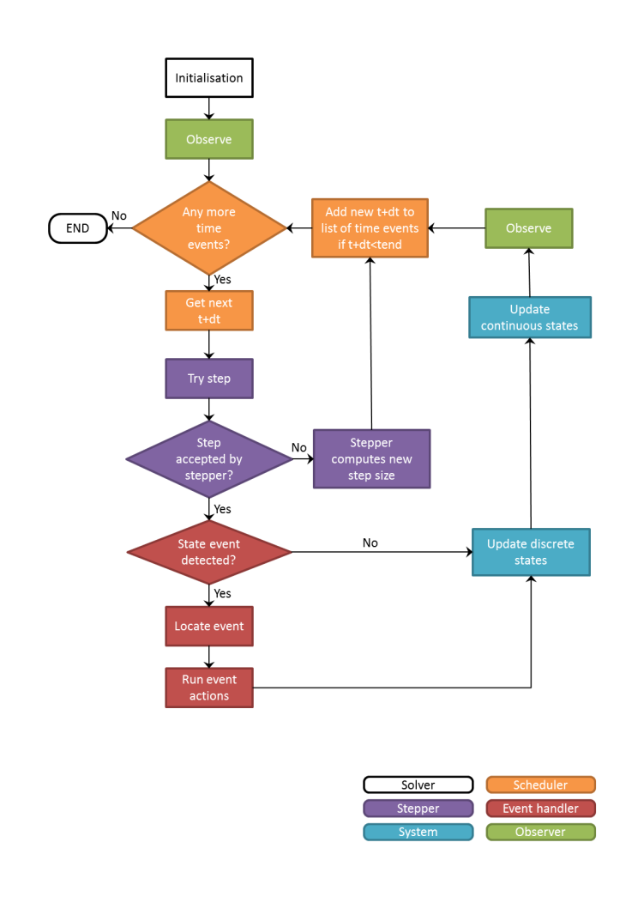
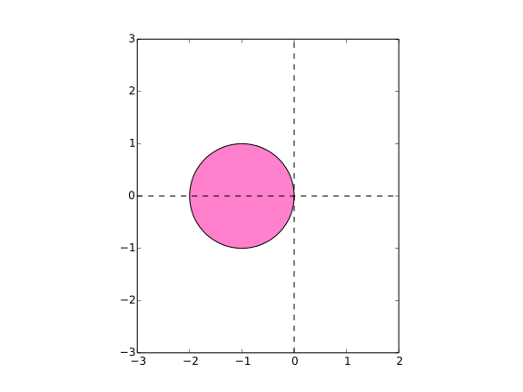

# Fonctionnement du solveur

Au coeur du simulateur, le solveur réalise l'intégration temporelle des équations
différentielles ordinaires.

## Formulation du problème

Soit $`n\in\mathbf{N}^*`$, $`p\in\mathbf{N}`$, $`m\in\mathbf{N}`$.
On appelle *modèle* une fonction

```math
f:\mathbf{R}^n\times\mathbf{R}^m\times\mathbf{R}\times\mathbf{R}^p\rightarrow\mathbf{R}^n
```


- $`n`$ est appelé "nombre d'états"
- $`p`$ désigne le nombre de paramètres du système
- $`m`$ est le nombre d'entrées du système

Une fonction dérivable $X:t\in\mathbf{R}\mapsto X(t)\in\mathbf{R}^n$ est
appelée *vecteur d'états* de ce système: ce sont les variables qui
résument toutes les informations calculées par le modèle (par exemple,
position, attitude, vitesse angulaire et vitesse de rotation).

$`U\in\mathbf{R}^m`$ sont les *entrées* du système (par exemple des commandes).

$`P\in\mathbf{R}^p`$ sont les paramètres du système, c'est-à-dire les constantes.

L'équation différentielle que l'on souhaite intégrer est :


```math
\dot{X} = \frac{dX(t)}{dt} = f(X,U,t,P)
```


## Architecture générale

Le solveur comprend cinq éléments :

- un *stepper* qui calcule, pour un pas d'intégration $`dt`$, $`X(t+dt)`$ en
fonction de $`f`$, $`X`$, $`U`$, $`t`$ et $`P`$.
- un *scheduler* qui calcule le prochain pas de temps (et donc le pas
d'intégration $`dt`$ en tenant compte d'éventuels évènements (discontinuités de
la fonction $`f`$)).
- un *event handler* qui s'occupe de la localisation et du traitement des
évènements. C'est ce composant qui détermine quelles sont les actions à
réaliser lorsqu'un évènement est détecté (redémarrage du solveur, arrêt,
changement des états...).
- un *observer* dont la fonction est de réaliser des actions en cours de
simulation (par exemple, exporter des états vers un fichier ou vers un système
de visualisation).
- un *system* qui implémente le calcul de la fonction $`f`$.

La figure suivante illustre les interactions entre ces composants.



## Steppers

Les steppers réalisent l'intégration de $`f`$ sur un pas de temps. Actuellement,
trois steppers sont implémentés :

### Euler


```math
\hat{X}(t+dt) = X(t) + f(X,t,U,P)\cdot dt
```

C'est le stepper le plus rapide, mais aussi le moins stable
numériquement : si cette méthode est appliquée à l'équation différentielle
$y'=k y$, alors la solution numérique est instable lorsque le produit $dt\cdot  k$
est en-dehors de la région $\left\{z\in\mathbf{C} : \left\|z+1\right\| \leq
1\right\}$.
En pratique, il n'est utilisé que pour des tests car les autres steppers
montrent de meilleures performances.



### Runge-Kutta 4


```math
\hat{X}(t+dt) = X(t) + \frac{dt}{6}\left(k_1 + 2k_2 + 2k_3 + k_4\right)
```

avec

```math
k_1 = f(X, t, U, P)
```


```math
k_2 = f\left(X+\frac{dt}{2}\cdot k_1, t + \frac{dt}{2}, U, P\right)
```


```math
k_2 = f\left(X+\frac{dt}{2}\cdot k_2, t + \frac{dt}{2}, U, P\right)
```


```math
k_4 = f\left(X+dt\cdot k_3, t+dt, U, P\right)
```


C'est un stepper très utilisé dans l'ingénierie.


### Runge-Kutta Cash-Karp

C'est une méthode à pas adaptatif qui permet d'estimer l'erreur d'intégration.
L'estimation de l'erreur est utilisée pour contrôler le pas d'intégration du schéma.

$``$\hat{X}(t+dt) = X(t) + \frac{37}{378}\cdot k_1 + \frac{250}{621}\cdot k_3 +
\frac{125}{594}\cdot k_4 + \frac{512}{1771}\cdot k_6$``$

L'erreur commise est approchée par la relation suivante

$``$e(t+dt) = \left(\frac{37}{378} - \frac{2825}{27648}\right)\cdot k_1 +
            \left(\frac{250}{621} - \frac{18575}{48384}\right)\cdot k_3 +
            \left(\frac{125}{594} - \frac{13525}{55296}\right)\cdot k_4 +
            \left(- \frac{277}{14336}\right)\cdot k_5 +
            \left(\frac{512}{1771} - \frac{1}{4}\right)\cdot k_6$``$

avec


```math
k_1 = dt\cdot f\left(X, t, U, P\right),
```


```math
k_2 = dt\cdot f\left(X + \frac{1}{5}\cdot k_1, t+\frac{1}{5}\cdot dt, U, P\right),
```


```math
k_3 = dt\cdot f\left(X + \frac{3}{40}\cdot k_1 + \frac{9}{40}\cdot k_2, t+\frac{3}{10}\cdot dt, U, P\right),
```


```math
k_4 = dt\cdot f\left(X + \frac{3}{10}\cdot k_1 + \frac{-9}{10}\cdot k_2 + \frac{6}{5}\cdot k_3, t+\frac{3}{5}\cdot dt, U, P\right),
```


```math
k_5 = dt\cdot f\left(X + \frac{-11}{54}\cdot k_1 + \frac{5}{2}\cdot k_2 +\frac{-70}{27}\cdot k_3+ \frac{35}{27}\cdot k_4, t+ dt, U, P\right),
```


```math
k_6 = dt\cdot f\left(X + \frac{1631}{55296}\cdot k_1 + \frac{175}{512}\cdot k_2 + \frac{575}{13824}\cdot k_3 + \frac{44275}{110592}\cdot k_4  + \frac{253}{4096}\cdot k_5, t+\frac{7}{8}\cdot dt, U, P\right),
```


